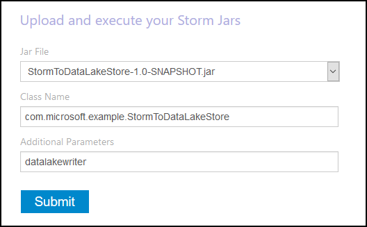
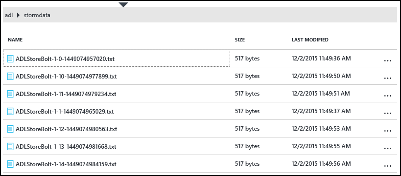

# hdinsight-storm-azure-data-lake-store

This project demonstrates how to use a Java-based Storm topology to write data to Azure Data Lake Store using the [HdfsBolt](http://storm.apache.org/javadoc/apidocs/org/apache/storm/hdfs/bolt/HdfsBolt.html) component, which is provided as part of Apache Storm.

__NOTE__: This will probably only work with HDInsight clusters, as it relies on some core-site entries that tell it how to talk to Azure Data Lake Store, as well as some of the server-side components (hadoop-client, hadoop-hdfs,) having support for communicating with Data Lake Store

## How it works

This uses the Storm HdfsBolt to write data to Azure Data Lake Store. This is a standard bolt provided as part of Apache Storm. The URL you use for the bolt, as well as the server-side configuration and components, are where the magic happens.

Here's the code that writes to data lake store:

    // 1. Create sync and rotation policies to control when data is synched
    //    (written) to the file system and when to roll over into a new file.
    SyncPolicy syncPolicy = new CountSyncPolicy(1000);
    FileRotationPolicy rotationPolicy = new FileSizeRotationPolicy(0.5f, Units.KB);
    // 2. Set the format. In this case, comma delimited
    RecordFormat recordFormat = new DelimitedRecordFormat().withFieldDelimiter(",");
    // 3. Set the directory name. In this case, '/stormdata/'
    FileNameFormat fileNameFormat = new DefaultFileNameFormat().withPath("/stormdata/");
    // 4. Create the bolt using the previously created settings,
    //    and also tell it the base URL to your Data Lake Store.
    // NOTE! Replace 'MYDATALAKE' below with the name of your data lake store.
    HdfsBolt adlsBolt = new HdfsBolt()
		.withFsUrl("adl://MYDATALAKE.azuredatalakestore.net/")
      	.withRecordFormat(recordFormat)
      	.withFileNameFormat(fileNameFormat)
      	.withRotationPolicy(rotationPolicy)
      	.withSyncPolicy(syncPolicy);
    // 4. Give it a name and wire it up to the bolt it accepts data
    //    from. NOTE: The name used here is also used as part of the
    //    file name for the files written to Data Lake Store.
    builder.setBolt("ADLStoreBolt", adlsBolt, 1)
      .globalGrouping("finalcount");
      
The rest of the topology is just "emit a value, count it" to generate data to write out to data lake store.

## Running this sample

You will need the following to run this example:

* A Storm on HDInsight cluster (Linux or Windows based)

* [Java JDK 1.7](https://www.oracle.com/technetwork/java/javase/downloads/jdk7-downloads-1880260.html) or highter

* [Maven 3.x](higher)

### Build the sample

1. Download the example project to your development environment.

2. Open the `StormToDataLake\src\main\java\com\microsoft\example\StormToDataLakeStore.java` file in an editor and find the line that contains `.withFsUrl("adl://MYDATALAKE.azuredatalakestore.net/")`. Change __MYDATALAKE__ to the name of the Azure Data Lake Store you used when creating your HDInsight server.

3. From a command prompt, terminal, or shell session, change directories to the root of the downloaded project, and run the following commands to build and package the topology.

        mvn compile
        mvn package
    
    Once the build and packaging completes, there will be a new directory named `target`, that contains a file named `StormToDataLakeStore-1.0-SNAPSHOT.jar`. This contains the compiled topology.

###Deploy and run on Linux-based HDInsight

If you created a Linux-based Storm on HDInsight cluster, use the steps below to deploy and run the topology.

1. Use the following command to copy the topology to the HDInsight cluster. Replace __USER__ with the SSH user name you used when creating the cluster. Replace __CLUSTERNAME__ with the name of the cluster.

        scp target\StormToDataLakeStore-1.0-SNAPSHOT.jar USER@CLUSTERNAME-ssh.azurehdinsight.net:StormToDataLakeStore-1.0-SNAPSHOT.jar
    
    When prompted, enter the password used when creating the SSH user for the cluster. If you used a public key instead of a password, you may need to use the `-i` parameter to specify the path to the matching private key.
    
    Note: If you are using a Windows client for development, you may not have an `scp` command. If so, you can use `pscp`, which is available from [http://www.chiark.greenend.org.uk/~sgtatham/putty/download.html](http://www.chiark.greenend.org.uk/~sgtatham/putty/download.html).

2. Once the upload completes, use the following to connect to the HDInsight cluster using SSH. Replace __USER__ with the SSH user name you used when creating the cluster. Replace __CLUSTERNAME__ with the name of the cluster.

        ssh USER@CLUSTERNAME-ssh.azurehdinsight.net

    When prompted, enter the password used when creating the SSH user for the cluster. If you used a public key instead of a password, you may need to use the `-i` parameter to specify the path to the matching private key.
    
    Note: If you are using a Windows client for development, follow the information in [Connect to Linux-based HDInsight with SSH from Windows](https://azure.microsoft.com/documentation/articles/hdinsight-hadoop-linux-use-ssh-windows/) for information on using the PuTTY client to connect to the cluster.
    
3. Once connected, use the following to start the topology:

        storm jar StormToDataLakeStore-1.0-SNAPSHOT.jar com.microsoft.example.StormToDataLakeStore datalakewriter
    
    This will start the topology with a friendly name of `datalakewriter`.

###Deploy and run on Windows-based HDInsight

1. Open a web browser and go to HTTPS://CLUSTERNAME.azurehdinsight.net, where __CLUSTERNAME__ is the name of your HDInsight cluster. When prompted, provide the admin user name (`admin`) and the password that you used for this account when the cluster was created.

2. From the Storm Dashboard, select __Browse__ from the __Jar File__ drop-down, then select the StormToDataLakeStore-1.0-SNAPSHOT.jar file from the `target` directory. Use the following values for the other entries on the form:

    * Class Name: com.microsoft.example.StormToDataLakeStore
    * Additional Parameters: datalakewriter
    
    

3. Select the __Submit__ button to upload and start the topology. The result field below the __Submit__ button should display information similar to the following once the topology has started:

        Process exit code: 0
        Currently running topologies:
        Topology_name        Status     Num_tasks  Num_workers  Uptime_secs
        -------------------------------------------------------------------
        datalakewriter       ACTIVE     68         8            10        

###View output data

There are several ways to view the data. In this section we use the Azure Portal and the `hdfs` command to view the data.

Note: You should allow the topologies to run for several minutes before checking the output data, so that data has been synched to several files on Azure Data Lake Store.

* __From the [Azure Portal](https://portal.azure.com)__: In the portal, select the Azure Data Lake Store that you used with HDInsight.

    Note: If you did not pin the Data Lake Store to the Azure portal dashboard, you can find it by selecting __Browse__ at the bottom of the list on the left, then __Data Lake Store__, and finally selecting the store.
    
    From the icons at the top of the Data Lake Store, select __Data Explorer__.
    
    
    
    Next, select the __stormdata__ folder. A list of text files should be displayed.
    
    
    
    Select one of the files to view its contents.

* __From the cluster__: If you have connected to the HDInsight cluster using SSH (Linux cluster,) or Remote Desktop (Windows cluster,) you can use the following to view the data. Replace __DATALAKE__ with the name of your Data Lake Store

        hdfs dfs -cat adl://DATALAKE.azuredatalakestore.net/stormdata/*.txt

    This will concatenate the text files stored in the directory, and display information similar to the following:
    
        406000000
        407000000
        408000000
        409000000
        410000000
        411000000
        412000000
        413000000
        414000000
        415000000

## Next steps   

For more information on using this sample, see [https://azure.microsoft.com/documentation/articles/hdinsight-storm-write-data-lake-store](https://azure.microsoft.com/documentation/articles/hdinsight-storm-write-data-lake-store).

## Project code of conduct

This project has adopted the [Microsoft Open Source Code of Conduct](https://opensource.microsoft.com/codeofconduct/). For more information see the [Code of Conduct FAQ](https://opensource.microsoft.com/codeofconduct/faq/) or contact [opencode@microsoft.com](mailto:opencode@microsoft.com) with any additional questions or comments.